# Specification Phase Exercise

A little exercise to get started with the specification phase of the software development lifecycle. In this exercise, your team specifies a set of improvements and new features for [The Slide Machine](https://theslidemachine.com) — see the [instructions](instructions.md) for detail, and the [background](background.md) for an introduction to the software product you are tasked with extending.

## Team members

- [Tracy Wang](https://github.com/TracyWang0904)
- [Emma Ao](https://github.com/emma6594)
- [Jingjing Wang](https://github.com/JingjingWang129)
- [Uuriintuya Ganzorig](https://github.com/Uuriii1003)

## Review of the Current Application

Findings from the team's independent use of [theslidemachine.com](https://theslidemachine.com).

### Strengths

- Speech recognition is clear and converts spoken language into consistent, natural-sounding text.
- A dedicated discovery/browse interface lets users search for colleagues' and other relevant finished slide decks to use as references.
- Supports uploading a previously created presentation and adding new, explanatory slides in the same format based on further voice input — an instructor can reuse a deck someone else made and personalize it while teaching their first class, saving prep time.
- The AI read-aloud (narration) feature gives coherent explanations rather than simply reading the slide text verbatim, which is friendly to self-study — a student who finds a useful deck online can upload it and listen to the AI's "lecture," which benefits auditory learners.

### Weaknesses

- Cannot generate an introduction/opening slide without voice input.
- When spoken input is short, transcription is unreliable and drops parts of the speech.
- Some slide themes make text hard to read because text and visual elements compete for the same space.
- Text editing is limited: existing text can be changed, but no new text box can be added, which limits how much information can be inserted.
- Text formatting is very limited: the editor lets users change text content but provides no controls for basic formatting such as font style or size.
- Changing the layout/style of one slide changes the whole presentation's style, rather than only that slide.
- If an instructor later adds more to a topic mentioned earlier, the new slide cannot be placed near the other slides on that topic — slides are ordered strictly by when they were spoken.
- Quiz answers tend to be the most specific/longest option, because quiz questions are generated directly from slide text and pull answers verbatim from it.
- The distinction between "add slide" and "add whiteboard" is unclear from the button labels alone; a first-time user has to experiment with both to learn when to use each.
- The delete-slide action is hard to discover during editing — the functionality exists but is not visible without extra searching.

### Gaps

- No way to provide a URL/website as seed material.
- Refinement changes apply immediately, with no save/confirm step before they take effect.
- No undo button.
- Limited ability to add custom visual elements such as shapes, icons, graphics, or photos.
- No support for understanding/transcribing other languages.
- No apparent mechanism for an instructor to mark or revise a generated slide after verbally correcting or updating what they said (needs re-testing to confirm).
- No live draft control: no mechanism to temporarily hold, discard, or revise AI-generated slide content created from a spoken idea that wasn't yet finished.
- No mechanism to mark certain spoken content as non-lecture material so it doesn't influence generated slides (needs re-testing to confirm).
- No mechanism for an instructor to signal they are returning to or continuing an earlier topic during live generation.

## Prior Art & Originality

Our proposal has two new mechanisms, both centered on the live lecture while it is still being captured. **Instructor side:** a "Branch" button lets the instructor split a spoken tangent off into its own slide, attached beneath the main slide it diverged from; editing or deleting that branch afterward reuses the app's existing content-editing and slide-deletion tools, applied to this new slide type. **Student side:** the instructor can generate a share link while the session is still recording; a student who opens it follows the deck live (read-only) and can attach a private, per-slide comment that only they can see, which carries into their own personal copy of the deck when it's exported.

Several of these directions trace directly to gaps our own team found while using the live app (see [Review of the Current Application](#review-of-the-current-application) above) — most directly, "a new slide can't be placed near earlier slides on the same topic" and the discoverability issue we noted with the existing delete-slide action.

**What we checked:** the SDD's Future Work (§18), Open Questions (§19), the Delivery Roadmap, and open GitHub issues — none mention a branch/tangent concept, a live (pre-save) share link, or private per-slide comments. The closest adjacent items: `GEN-8` only ever decides "update the current slide" or "start a new slide," never a branch to set aside and rejoin; `SHARE-1` shares a deck only **after** it's saved, never while still generating; and Future Work's "multi-user collaborative editing" is about several people jointly editing *shared* content — the opposite of one student's **private**, read-only annotations. No comment or annotation surface of any kind exists in the app today, for any user. Issue #27 ("Required Transcript Viewing") is the closest open issue, and it argues the opposite of our concern (forcing linear playback).

**What is new:** the branch concept itself (a slide can now have a tangent split off and stay attached to it); a live, read-only share link available before the deck is saved; and private, per-slide student comments that persist into a personal export copy. None of this appears in the current application, the SDD, the Roadmap, or any open issue we reviewed.

## Stakeholders

### Instructors

- **Baohua** — Differential Geometry TA
- **Yuchen** — Calculus III TA

**Goals / needs:**

1. Keep unscripted, off-topic Q&A during a review session out of the official generated slides, so slides stay focused on useful instructional content rather than every spoken exchange.
2. Support a workflow built around professor-assigned quizzes and pre-prepared examples, rather than fully on-the-fly generation.
3. Reliable speech recognition for math/technical vocabulary, including tolerance for non-standard pronunciation and disambiguation of similar-sounding terms across disciplines.
4. Preserve useful explanations and examples as organized notes that students can review after the session.
5. Accurately represent mathematical content — equations, symbols, and graphics — that speech-to-text alone cannot reliably capture.

**Problems / frustrations:**

1. Real-time slide generation itself creates pressure, since the TA has to teach while also worrying about messy or tangential Q&A being recorded as "official" material.
2. Math TAs generally prefer the blackboard; the format doesn't obviously fit how they already like to teach, especially for handwritten equations, symbols, diagrams, and graphs.
3. When the AI misjudges a topic shift and files content under the wrong slide, the only fix today is reorganizing the deck by hand after the session ends.
4. Review sessions are highly non-linear — unexpected questions, tangents, and fragmented conversations — which should not automatically become slides.
5. Speech recognition may misinterpret specialized terminology, particularly similar-sounding technical terms or non-standard pronunciation.

### Students

- **Heidi L.**
- **Jocelyn Y.**
- **Judy Y.**
- **Urangoo C.**
- **Riko E.**

**Goals / needs:**

1. A visual marker distinguishing branch/tangent slides from main-line content, so it's clear what's supplementary versus core lecture material when reviewing.
2. Any live correction the instructor makes (e.g., reclassifying a slide's topic, or merging it back into the main line) should show up clearly in the final shared deck, rather than leaving it ambiguous what changed.
3. Slides that accurately reflect what the instructor explained during the lecture, including important examples and explanations.
4. An easy way to review topics that were difficult to understand, without having to go through the entire presentation again.
5. Lecture materials organized so it's easy to follow the order and connection between different topics.

**Problems / frustrations:**

1. May miss important information when the instructor moves quickly through a topic or changes topics during the lecture.
2. May have difficulty remembering where a specific topic or explanation appeared when reviewing the lecture later.
3. May have difficulty finding important information when a lecture contains a large number of slides or a lot of content.
4. Worried that content seen live during the lecture may not match the final shared deck, since the instructor can reorganize, merge, or reclassify slides afterward, leaving their own notes/screenshots out of sync with the official version.

## Product Vision Statement

The Slide Machine should let instructors branch a spoken tangent off the main slide live, and let students follow that same deck in real time with their own privately annotated copy.

## User Requirements

### Instructors

1. As an instructor, I want to mark a spoken aside as a tangent while I'm still talking, so that it becomes a branch off the current slide.
2. As an instructor, I want to see which topic the AI is currently adding new content to, so that I can redirect it to a different slide if it's about to file something in the wrong place.
3. As an instructor, I want to reclassify an already-generated slide as a branch after I realize the discussion turned into a tangent, so that the deck's structure still reflects what actually happened even though I didn't catch it at the moment.
4. As an instructor, I want to merge a branch slide back into its main-line slide, so that content that turned out not to be a real tangent doesn't stay separated for no reason.
5. As an instructor, I want to delete a branch slide I no longer need, so that irrelevant tangents don't clutter the final deck.
6. As an instructor, I want to undo my last structural action (branch, merge, split, or reclassification) immediately after making it, so that I can recover quickly if the system misunderstood my intent.
7. As an instructor, I want to be notified when marking a tangent fails due to a network or recognition error, so that I know the content was captured as a normal slide instead and isn't lost.
8. As an instructor, I want to move a branch slide to attach it to a different main-line slide, so that I can correct it if it ended up associated with the wrong topic.
9. As an instructor, I want to explicitly signal "continue previous topic" to rejoin an earlier main-line slide instead of starting a new one, so that returning to something I already covered doesn't fragment the deck.
10. As an instructor, I want to split an already-generated slide into two once I realize it covers two separate topics, so that each topic gets its own slide without waiting for a post-lecture reformat.
11. As an instructor, I want to generate a shareable link to the deck while a session is still live, so that students can follow along on their own devices in real time.
12. As an instructor, I want a branch slide to stay attached to its main-line slide when exporting the deck, even if the two are organized into different folders, so that a branch is never separated from the topic it belongs to.
13. As a mathematics instructor, I want to quickly correct a misrecognized technical term, spoken mathematical expression, or diagram/graph the system couldn't capture from speech alone, without stopping the lecture, so that later generated slides use the correct terminology and notation without requiring me to stop speaking.

### Students

1. As a student, I want to see when the instructor corrected or reclassified a slide during the lecture, so that the shared deck doesn't leave me confused about which version of a slide is the final one.
2. As a student, I want to see supplementary branches connected to a lecture topic, so that I can explore related material without losing the main lecture structure.
3. As a student, I want to see questions other students have already asked and the professor's answers, so that I can find answers to my own questions without having to ask the professor again.
4. As a student, I want to open a supplementary branch from the point where it appears in the lecture, so that I can understand how the related material connects to the main topic.
5. As a student, I want to return to the main lecture from a supplementary branch, so that I can continue following the lecture without losing my place.
6. As a student, I want to skip a supplementary branch, so that I can stay focused on the main lecture when the related material is not relevant to me.
7. As a student, I want to filter branch/tangent slides out of the deck when studying for the quiz, so that I only review the main-line content the lecture was actually about.
8. As a student, I want to see which slides were reorganized after the live session ended, so that notes I took during the original lecture don't reference a structure that no longer exists.
9. As a student, I want to open a live-shared link to the deck while the instructor is still generating it, so that I can follow the lecture on my own device as it happens.
10. As a student, I want to add a private comment to a slide while viewing the live-shared deck, so that I can record my own thoughts or questions without anyone else seeing them.
11. As a student, I want my private comments to remain attached to their slide after the session ends and the deck is saved, so that reviewing later feels like looking at my own personal copy.
12. As a student, I want to edit or delete a private comment I made, so that I can correct or remove notes I no longer need.
13. As a student, I want the live-shared deck to update automatically as the instructor generates or restructures slides, so that I'm always seeing the current state of the lecture without needing to refresh or re-open the link.

## Activity Diagrams

### Instructors

**User Story:** As an instructor, I want to mark a spoken aside as a tangent while I'm still talking, so that it becomes a branch off the current slide.

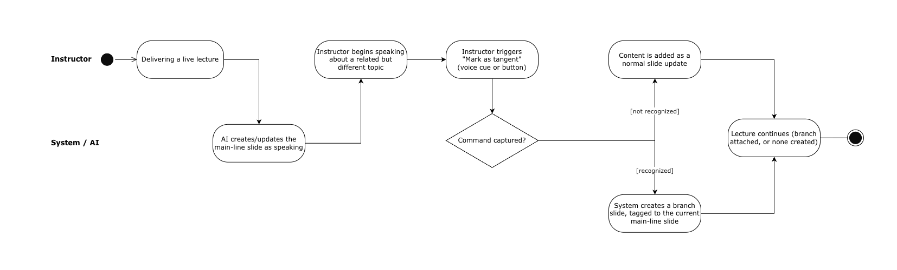

**User Story:** As a mathematics instructor, I want to quickly correct a misrecognized technical term, spoken mathematical expression, or diagram/graph the system couldn't capture from speech alone, without stopping the lecture, so that later generated slides use the correct terminology and notation without requiring me to stop speaking.

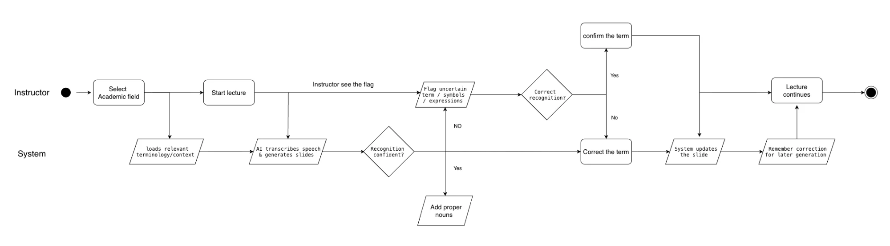

### Students

**User Story:** As a student, I want to see questions other students have already asked and the professor's answers, so that I can find answers to my own questions without having to ask the professor again.

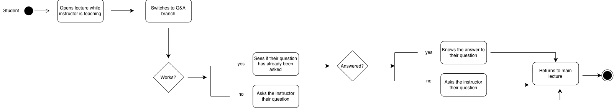

**User Story:** As a student, I want to open a supplementary branch from the point where it appears in the lecture, so that I can understand how the related material connects to the main topic.

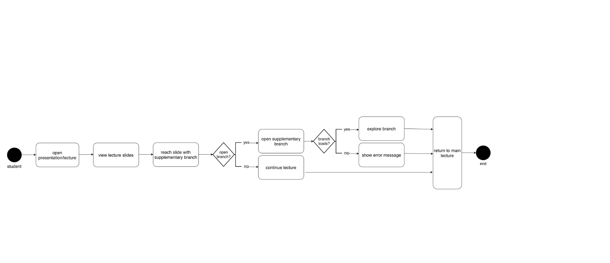

## Wireframes

### Instructors

**Live Session (changed screen)** — the existing live-capture screen, with new "Branch" and "Real-time Sharing" controls added to its toolbar. Clicking "Real-time Sharing" opens a link to copy and share with students.

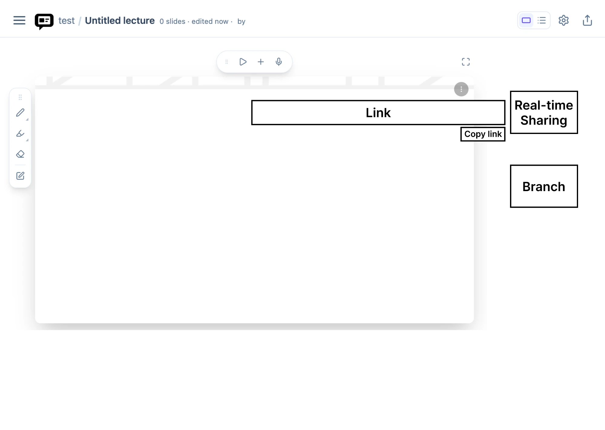

**Branch slide (new screen)** — a branch slide created from the Branch button, shown attached beneath the main slide it diverged from.

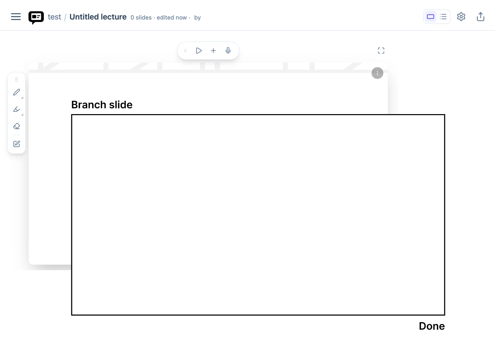

**Branch slide, delete action (new screen)** — the branch slide's delete control, for removing a branch the instructor no longer needs.

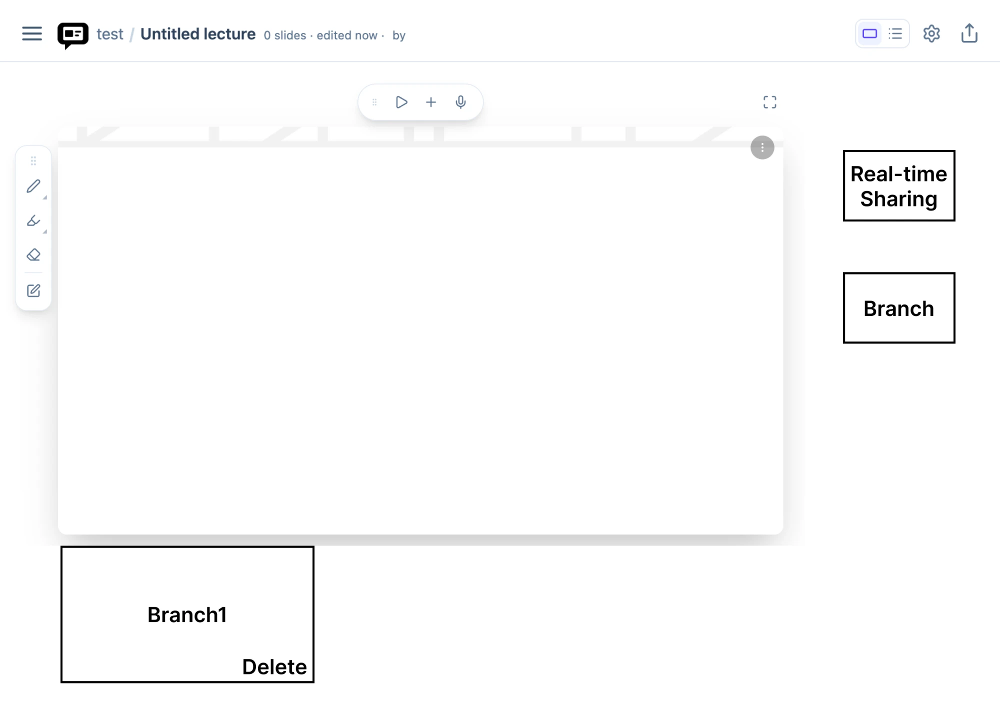

**Lecture settings (changed screen)** — the existing lecture settings page, with the lecture title now showing the Main/Branch1/Branch2 breakdown so each part of the lecture can be named and exported separately while staying attached to the same lecture.

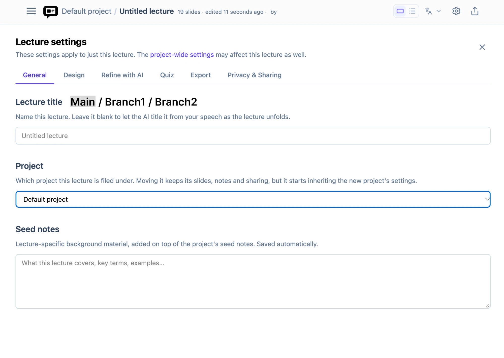

### Students

**Add private comment (new screen)** — the "Add comment" control opens a blank comment box on the branch slide the student is viewing.

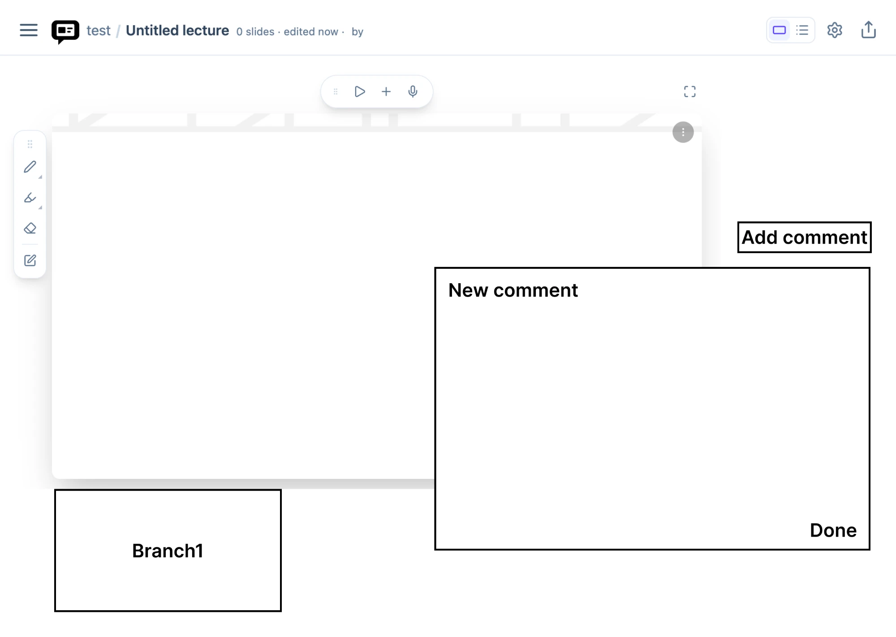

**Edit/delete private comment (new screen)** — an existing comment shown with a Delete action, so a student can remove a comment they no longer need.

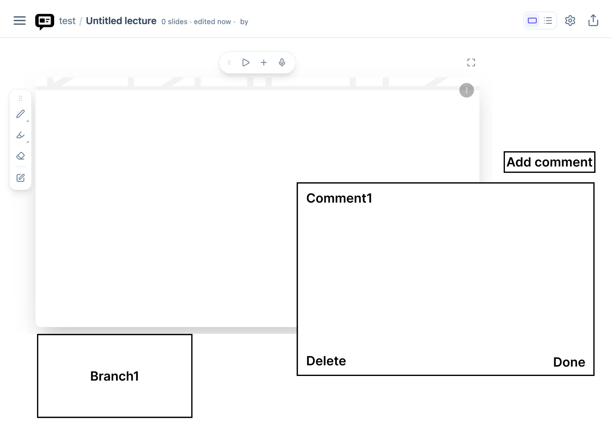

**Comment indicator, collapsed (new screen)** — the "Add comment" control and an existing comment shown collapsed as small tags, so a student can see a comment exists without it covering the slide.

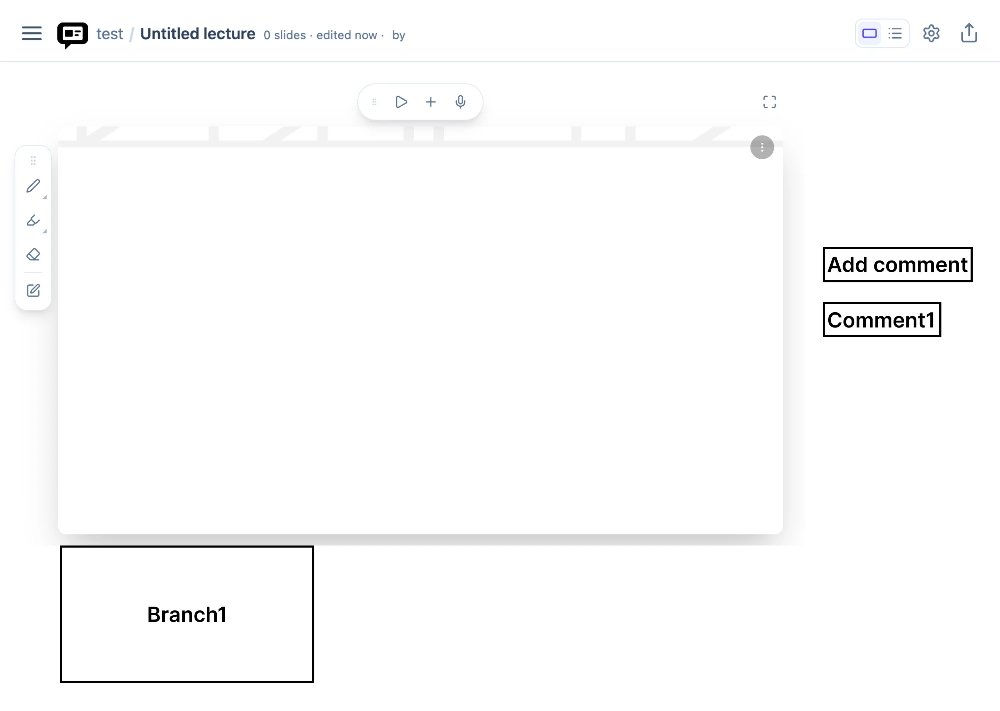

**Branch slide with comment entry point (new screen)** — the "Add comment" control as it appears directly on a branch slide the student is viewing.

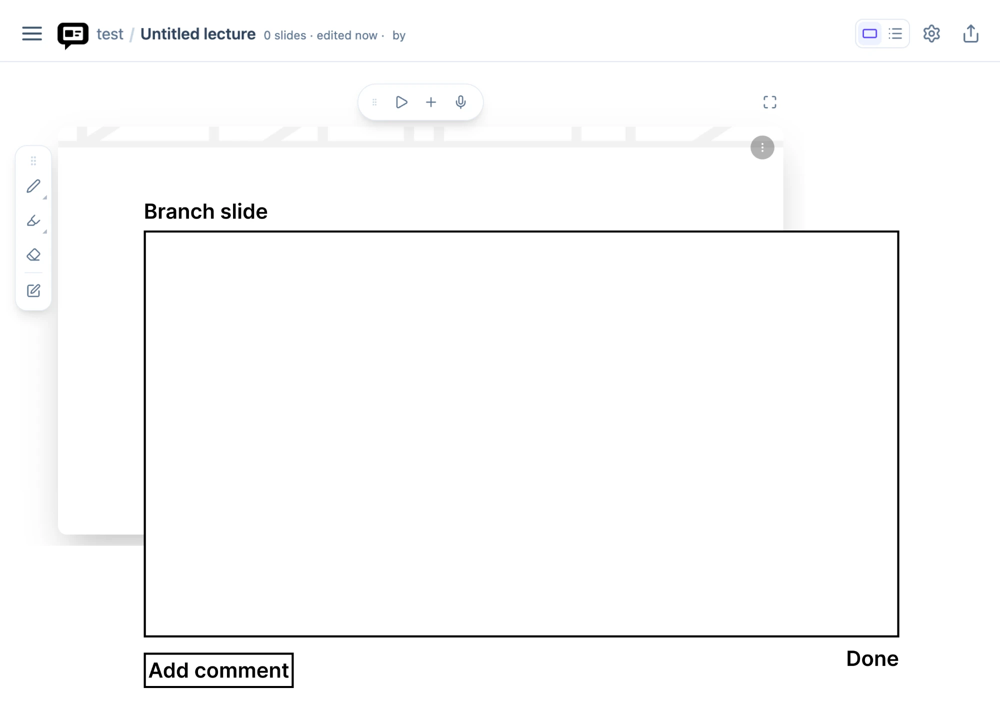

**Compose a comment on the branch slide (new screen)** — the new-comment box open directly over the branch slide, with separate confirm controls for the comment and for the branch view.

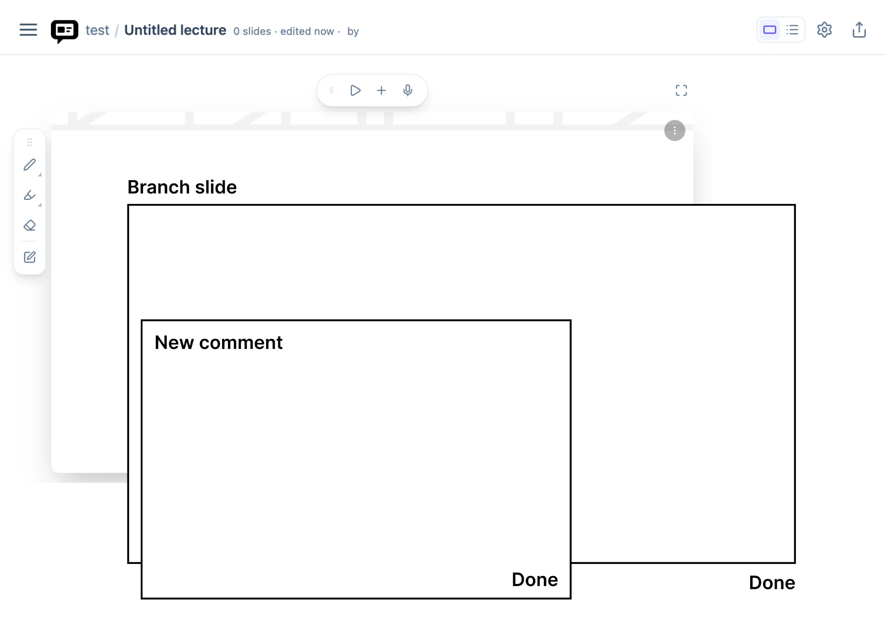

**Comment tags on the branch slide, collapsed (new screen)** — the Add comment control and an existing comment shown as collapsed tags directly on the branch slide.

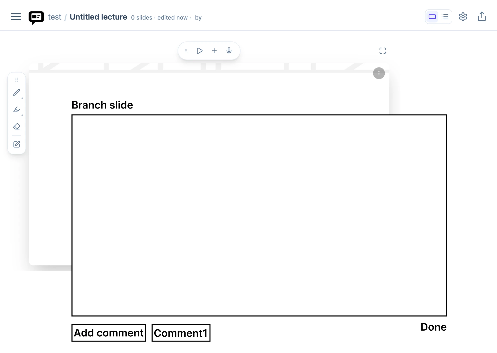

**Comment detail with delete, on the branch slide (new screen)** — an existing comment opened on the branch slide with a Delete option.

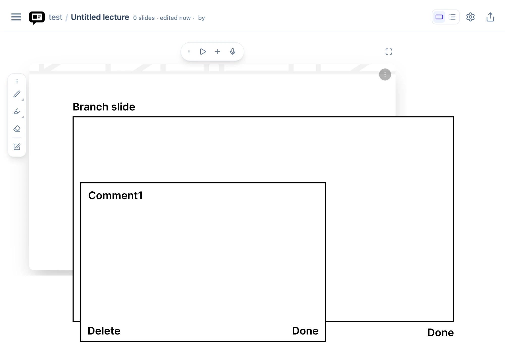

**Save/export with private comments (same screen as the instructor's, different meaning for this user)** — the same Lecture settings screen instructor uses to name Main/Branch1/Branch2 is also how a student saves their own copy of the deck, with their private comments carried along, when they export it.

## Clickable Prototype

- **Instructor flow:** [Figma prototype](https://www.figma.com/proto/yj9iB0YIvhusXyW7WlESZT/Wireframe-ByteMe?node-id=0-1&t=kXF9qhMqR7ksfjA1-1)
- **Student flow:** [Figma prototype](https://www.figma.com/proto/yj9iB0YIvhusXyW7WlESZT/Wireframe-ByteMe?node-id=30-2&t=kXF9qhMqR7ksfjA1-1)

## Stakeholder Demo

[Generated deck](https://theslidemachine.com/d/untitled-b0b0f64e)

## Exit Ticket

[Exit-ticket quiz](https://docs.google.com/forms/d/e/1FAIpQLSdXsUXZjz86uBnFOLLVQ85ILAulQaZB0-lxLsOkjkF_5BbdUQ/viewform)

**Corrections before publishing:** We reviewed the generated questions and found nothing that needed fixing.
